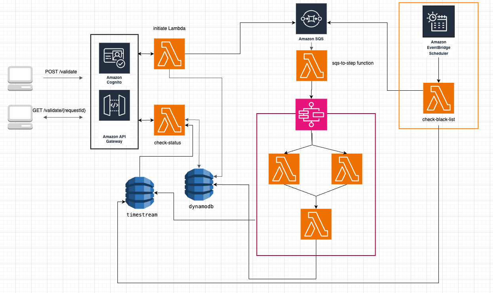

AWS CDK project for email validation and user registration with SSO (Google, Facebook).

## Templates based repo (outdated version of the repo below):
https://bitbucket.org/teamworkspirit/aws-email-validator/src/development/

## Prerequisites

- AWS CLI configured
- Node.js >=21 installed
- cdk installed

## Steps to deploy

1. cp.env.example .env and fill the variables (for local testing enough to COGNITO_DOMAIN_PREFIX)
2. npm install
3. npm run build
4. npx cdk deploy --profile {your_aws_profile_with_good_permissions}

## Usage

- Request to start validation

```shell
POST https://{your_gw_endpoint}.execute-api.us-east-1.amazonaws.com/prod/validate
Authorization: {id_token_from_ouauth(hosted_UI cognito section)}
Content-Type: application/json

{
"email": "vladbbk@hotmail.com"
}
```

example of response

```shell
{
  "requestId": "c4a8c3d9-4e10-433f-8bbd-de1aa61de018"
}
```

- Check the status of validation and result

```shell
GET https://k40vx6ypq7.execute-api.us-east-1.amazonaws.com/prod/validate/c4a8c3d9-4e10-433f-8bbd-de1aa61de018
Authorization: {id_token_from_ouauth(hosted_UI cognito section)}
Accept: application/json
```

example of response

```shell
{
  "score": 15,
  "validationStatus": "completed",
  "email": "vladbbk@hotmail.com",
  "requestId": "e470fab3-ccab-43ff-903c-2a4e7bbe9ff9"
}
```

Understanding of score values:
- `0` - bad
- `<=10` - suspicious
- `>10`  - can be used
- `20` - good

Used tools:

- AWS CDK
- AWS Cognito
- AWS SQS
- AWS Lambda
- AWS Step Function
- AWS DynamoDB
- AWS GW

Structure:
This is Default CDK template but with some changes.

```shell 
|-/lambda - folder contains separate directories for each Lambda function and shared services,interfaces
  |--/functions/ - folder contains separate directories for each Lambda function
      |---/validation/ - this folder groups all validation-related Lambda functions together
          |----/check-status - a lambda function that called by API GW and return the status of validation and result
          |----/initiate-validation - a lambda that called by API GW and return requestId also initiate other steps like send to SQS and save to db
          |----/sqs-to-stepfunction - a lambda that triggered by SQS and start the AWS Step function execution
          |----/email-steps/ - a folder with lamdas that responsive for validation email and used in Step Function
              |-----/mx-validator - a lambda that validate MX record
              |-----/cname-validator - a lambda that validate CNAME
              |-----/result-aggregator - a lambda that aggreagte result from lambdas above and save to db final result
  |--/shared/ - folder contains reusable components like interfaces, services, and utilities, promoting DRY 
      |---/interfaces - a shared folder with interdaces for all lamdas
      |---/services - a shared folder with services for all lamdas
         |----/dynamo.service
         |----/email.service
      |---/...
```

Principal schema


**TODO LIST**
- [ ] Add Black/White email lists and lambda validation
- [ ] *Add SMT validation lambda
- [ ] Add widgets for CloudWatch on deploy
- [ ] Export validated emails to S3
